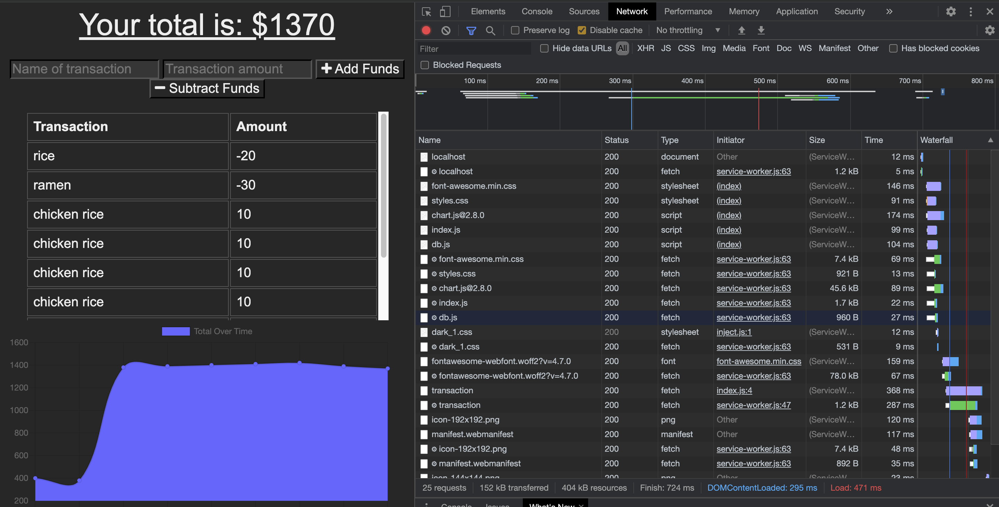
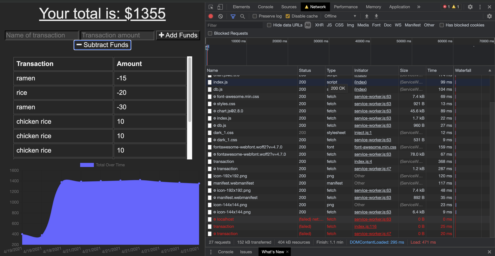

# PWA-online-offline-budget-tracker
A PWA (progressive web application) that allows the user to add/deduct their deposit and expenses to their budget with/without a connection. 

## Table of Contents

* [User Story](#User-Story)
* [Business Context](#Business-Context)
* [Technologies used to create app](#technologies-used)
* [Screenshots](#screenshots)
* [Useful resources](#Useful-resources)
* [Questions](#questions)

## User Story
AS AN avid traveller I WANT to be able to track my withdrawals and deposits with or without a data/internet connection SO THAT my account balance is accurate when I am traveling

## Business Context

Giving users a fast and easy way to track their money is important, but allowing them to access that information anytime is even more important. Having offline functionality is paramount to our applications success.

## Technologies Used

* HTML
* CSS
* Bootstrap 
* Javascript
* jQuery 
* Node.js 
* Express 
* MongoDB (mLab)
* Heroku (Application deployment )

## Screenshots

|

## Useful resources
* [NoSQL](https://en.wikipedia.org/wiki/NoSQL)
* [MongoDB Website](https://www.mongodb.com/)
* [Robo 3T Website](https://robomongo.org/download)
* [MongoJS Documentation](https://www.npmjs.com/package/mongojs)
* [Mongoose Documentation](http://mongoosejs.com/docs/guide.html)
* [MongoDB for your Heroku NodeJS app](https://www.youtube.com/watch?v=GDqtv1eGGpA)

## Questions
* For collaboration and questions, please reach out to carefree2706@gmail.com

* Contact me via Github [carefree2706@gmail.com](http://github.com/carefree2706@gmail.com)

- Launch the application <a href="https://floating-bayou-42669.herokuapp.com/" target="_blank"> > https://floating-bayou-42669.herokuapp.com/  < </a>
